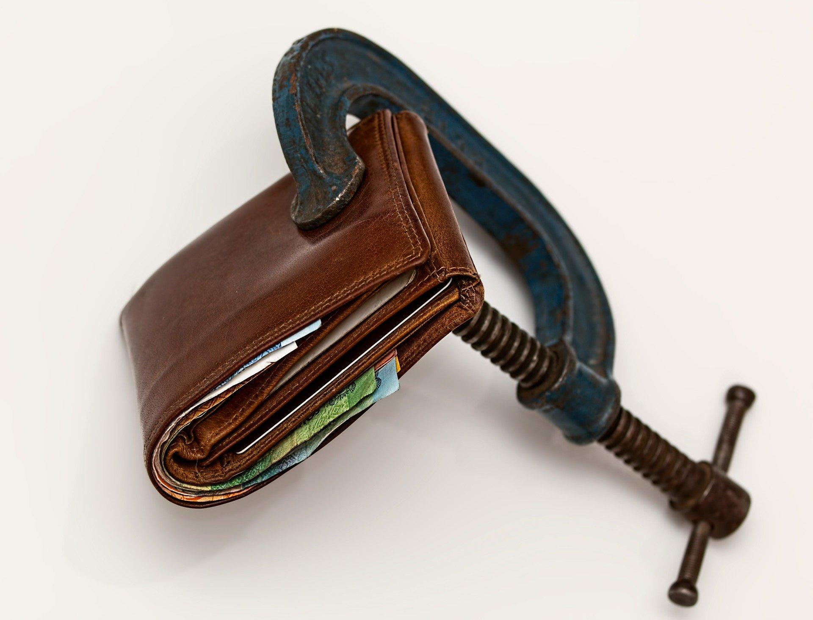

#Tags in this article: 'covid19','economics','health'

'covid19','economics','health'
'covid19','economics','health'
'covid19','economics','health'
'covid19','economics','health'
'covid19','economics','health'
'covid19','economics','health'
'covid19','economics','health'

'covid19','economics','health'
'covid19','economics','health'
'covid19','economics','health'
#Stay Home And Do These 7 Things Which Will Benefit You For The Rest Of Your Life

Crisis left many people isolated at their homes, with difficult concerns about personal and public health and safety. 
There was not a similar moment in human history where such big masses of population had to be grounded to their houses, have such unusual restrictions on physical movement, yet being exposed to that unlimited information and possibilities.
And whether you have millions in your bank account or having uncertainty in your future, the restrictions and the new lifestyle applies to everybody in the same way.

##Save Money

Now is the time to do your homework, double check all your life savings, insurance policies, retirement programs and mortgage installments.
Now is the time to educate yourself and understand exactly what your earnings and what are you paying for, and when. Take some time to read those small letters.

Remember – the world is in big financial uncertainty right now!
Unless you know exactly what you are doing, do not attempt for any kind of financial opportunities, needless to mention quick-and-easy-money promises!
Financial education and responsible attitude will always continue to serve you and your family.

##Learn How To Cook 

This is the time to fix your diet and expand your existing recipes or learn new ones. 
Find out what you need in order to create some basic tasty and healthy homemade food, easily quickly!
You may benefit and start a new era of healthy nutrition and awareness to what you consume. 
It may turn out to be a priceless step which will reduce the quantity of your junk food for years to come.

If you have bulk qualities of products, you can plan a healthy diet for yourself and your family, all based on homemade cooking.
There is unlimited quantity of recipes and nutrition facts available online and understanding what is needed for healthier nutrition has never been easier.
Avoiding deliveries of fast foot and replacing them with healthy grocery orders will give you a great starting point of healthy nutrition and will provide you a challenge big enough to improve your cooking skills and knowledge.

##Educate Yourself
Consider trends of the future. Many lessons learnt during crisis will continue to influence our lives and will change many of our habits.
Online shopping, virtual conferences, delivery by drones, farm-to-table supply chain and remote services will be implemented further in our day-to-day.
Are you maximizing all the opportunities which currently available to you? Are there any operations that mobile and web technology can make easier for you?
Now is a good time to boost your online knowledge and get started!

Search for more information and learn how to avoid various online frauds yet be aware of the constantly growing possibilities to do stuff remotely, saving time and efforts.
Since more and more stuff will be done remotely as time goes on, you will benefit from your acquired knowledge for many years to come. 

##Fitness & Recreation
No gym no problem! Try to allocate time for regular exercise and sport. If you are not working out in regular manner, now is the time to change it.
Staying constantly at home or not having a gym device in your living room shouldn’t prevent you from getting fit, especially now that you are following advice #1!
There are millions of fitness YouTube channels in case you are short of ideas, and you can find tons of materials of how to do this right.
You can start from the simplest aerobic exercises and move further.

By the end of the outbreak you will already see positive results, and of course, having a period of regular workout will provide you an excellent starting point for healthier and satisfying life for body and soul!

#Do Something By Yourself
Another way to spare your time is to do one of those do-it-yourself tasks which you never found the time for. DYI matters. 
Modern work environments are mainly about to operating a computer with almost nonphysical effort, and there is nothing like doing something with your own hands to get THAT feeling back.

Whether it is polishing an old piece of furniture, hanging shelves, painting, or learning to play a new instrument, that unexpected mass of free time can be properly used for obtaining handy skills and hobbies for years to come!

#Optimize Your Work From Home 

Modern world is being pushed further into remote employment practices. 
If until now, working from home often considered as a privilege and home-work balance, for the first time in human history, institutes are forced to transform their core systems for remote state solely.
This is a chance to examine the capability of your workstation at home and do the necessary setup to make your work from home as productive as possible.

Is your office equipment suitable for at least 8 working hours in a row? Are all your backup routines fresh? Are all your resources reachable? Is everything updated Is lightning good?
Being ready and having your systems set and running will help you to react quickly for incoming and will make your work more productive and sustainable.
Since probably one of the biggest changes of the modern employment will be the increase of remote work, following this step looks useful for the near future but as further as well.

#Calculate Stuff (And Save Money Again!)
Calculating our own consuming can be a good practice to save time and effort with money-saving bulk shopping.
How much you need?
If you never done this before try to create a global shopping list with the products which are used in your home per week and month.

Another interesting way of planning your supplies is to make a list of your favorite products and calculate the number of meals or washings which can be gained from each product. 
This way you will get another perspective which will help you to create a balanced diverse inventory.
Note that when dealing with bulk quantities, one must take into consideration also parameters of sealing, humidity and pests. 
As quantity grows, storage concerns grow as well.

